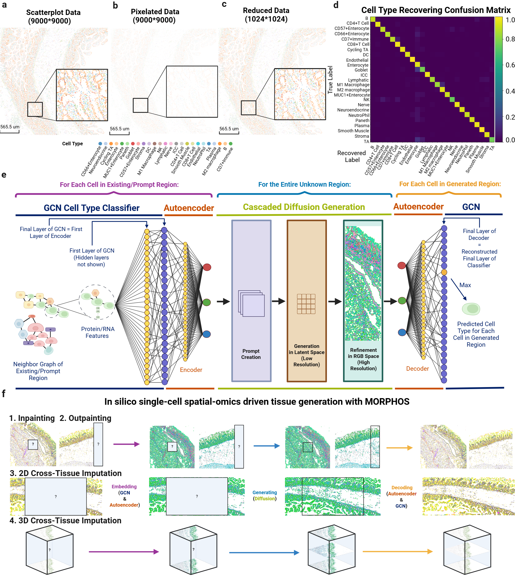

# MORPHOS

## Overview
*MORPHOS: Bridging Image Generation and Spatial Omics
for Tissue Synthesis*

**Authors:**  
Yuan Feng¹, Zachary Robers², Leyla Rasheed², Yang Miao¹, Shuo Wen³,  
James Sohigian², Maria Brbić³, John W. Hickey¹\*

¹ Department of Biomedical Engineering, Duke University, Durham, NC 27708, USA  
² Department of Computer Science, Duke University, Durham, NC 27708, USA  
³ School of Computer and Communication Sciences, EPFL, Lausanne CH-1015, Switzerland  


**Preprint:**  
[Link to bioRxiv]

### MORPHOS Pipeline

<p align="center">
  
</p>

### Abstract
Spatially resolved omics technologies reveal tissue organization at single-cell resolution but remain
limited by the cost of the assays, incomplete spatial coverage, 2D-only imaging, and experi-
mental artifacts. These factors motivate the need for in silico methods that can reconstruct or
extend tissue context beyond what current spatial measurements provide. We present MOR-
PHOS (Modeling Organized Representations of Probabilistic Hierarchical Organization in Space),
an AI framework that learns to synthesize biologically faithful tissue architecture directly from
spatial-omics data. MORPHOS introduces a graph-informed probabilistic embedding that maps
discrete cell identities and their spatial relationships into a continuous RGB-like latent space
compatible with diffusion modeling. This representational bridge enables spatial cellular maps
to leverage large pre-trained image-generative models while preserving biological interpretabil-
ity upon decoding. By modeling cells as the fundamental units of generation and learning how
their identities and spatial relationships collectively give rise to large-scale tissue structure, MOR-
PHOS enables generation and reconstruction of tissue architecture at single-cell resolution. We
applied the method across large-scale single-cell proteomic datasets from the intestine and single-
cell transcriptomic datasets from the brain, showing computational scalability acrosss millions of
cells. We used MORPHOS on these datasets to outpaint beyond experimentally restricted fields
of view, inpaint missing or experimentally damaged tissue regions, and perform cross-tissue impu-
tation, connecting separated tissue regions into a single contiguous sample in both 2D and 3D.
MORPHOS represents a new class of tissue generation algorithms that will help solve current
limitations and challenges with single-cell spatial-omics datasets.


## Repository Structure (Python Notebooks)
```text
DISCO/
│
├── Assets/                         
├── Baselines/                          # Comparisons
├── Embeddings/                         # GCNN & Autoencoder
│   ├── 01_GCN_classifier.ipynb
│   ├── 02_Autoencoder.ipynb
│   └── 03_Interpret_cellmap.ipynb  
├── Evaluation/                         # Evaluation Metrics
│   └── Evaluation.ipynb  
├── Finetune/                           # Latent Diffusion Finetune 
│   ├── Fluxfill/
│   │   ├── Train_Fluxfill.py
│   │   └── Fluxfill_outpainting.py
│   └── SD2/
│       ├── Train_SD2.py
│       └── SD2_Outpainting.py
├── Latent_Diffusion_Generator/            # Application training & inference
│   ├── 3D_Imputation/
│   │   ├── Train_3D_Imputation.ipynb
│   │   └── Infer_3D_Imputation.ipynb
│   ├── Arbitrary_Inpainting/
│   │   ├── Train_Arbitrary_Inpainting.ipynb
│   │   └── Infer_Arbitrary_Inpainting.ipynb
│   └── Outpainting_and_2D_Imputation/
│       ├── Training/ [NOTE TO SELF: What is in here?]
│       └── Inference/
│           ├── Inference_2D_Imputation.ipynb
│           └── Inference_Outpainting.ipynb
├── Pixel_Diffusion_Decoder/            # Pixel Diffusion Train and Decode [NOTE TO SELF: IS THIS BASELINE FOLDER?]
├── Preprocessing/                      # DISCO Preprocessing Pipeline
│   ├── 01_Conflict_statistics_and_cleaning.ipynb
│   ├── 02_Resolution_Reduction.ipynb
│   └── 03_Embedding_DATAQuality_minimum.ipynb                        
└── README.md
```
## Recommended execution order

### 1. Preprocessing Pipeline

1. `Preprocessing/01_Conflict_statistics_and_cleaning.ipynb` - Identify conflict statistics for Spatial omics cell map
2. `Preprocessing/02_Resolution_Reduction.ipynb` - Reduce resolution using dimensions and conflict cleaned data.

### 2. Embedding Pipeline
1. `Embeddings/01_GCN_classifier.ipynb` — learn spatial and marker informed probabilities  
2. `Embeddings/02_Autoencoder.ipynb` — compress probabilities to three-channel representation of pixel intensities

### 3. Latent Diffusion Generator (Application)

#### Arbitrary Inpainting
1. `Latent_Diffusion_Generator/Arbitrary_Inpainting/Train_Arbitrary_Inpainting.ipynb`
2. `Latent_Diffusion_Generator/Arbitrary_Inpainting/Infer_Arbitrary_Inpainting.ipynb`

#### 2D Imputation & Outpainting
- `Latent_Diffusion_Generator/Outpainting_and_2D_Imputation/Inference/Inference_2D_Imputation.ipynb`
- `Latent_Diffusion_Generator/Outpainting_and_2D_Imputation/Inference/Inference_Outpainting.ipynb`

#### 3D Imputation
1. `Latent_Diffusion_Generator/3D_Imputation/Train_3D_Imputation.ipynb`
2. `Latent_Diffusion_Generator/3D_Imputation/Infer_3D_Imputation.ipynb`

### 4. Decoding
3. `Embeddings/03_Interpret_cellmap.ipynb` — decode images back to original cell identities

### 5. Evaluation
`Evaluation/Evaluation.ipynb`
- RGB Centroid Distance Score  
- Neighbor KMeans Composition Matching Score  
- Cell Density Score  
- Spatial Structure Score  
- Cell Type Distribution Score  

#### Optional 
Baseline/Comparison Models

- `Baselines/MLP_classifier.ipynb`  
  Legacy baseline classifier for comparison (not part of the final DISCO pipeline)

Fine-tune Latent Diffusion (FluxFill and StableDiffusion2):

- `Finetune/Fluxfill/Train_Fluxfill.py`
- `Finetune/SD2/Train_SD2.py`

#### Affiliations
<p align="left">
  
  
</p>